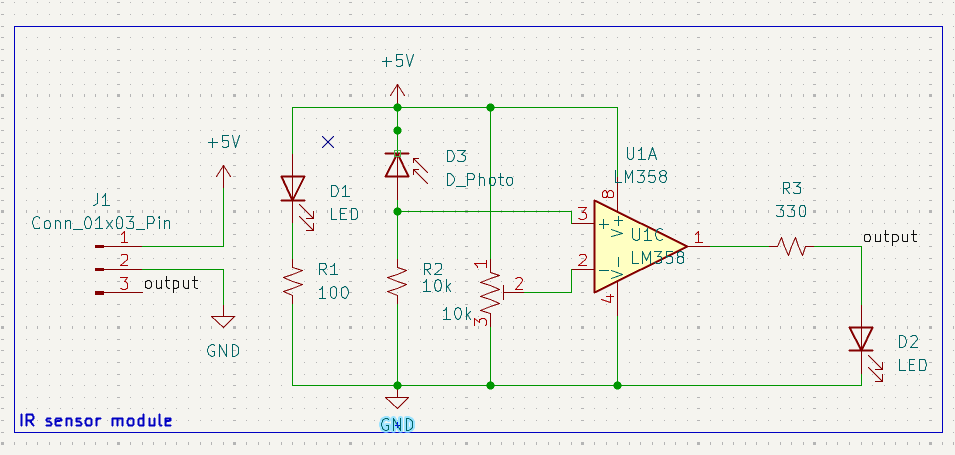
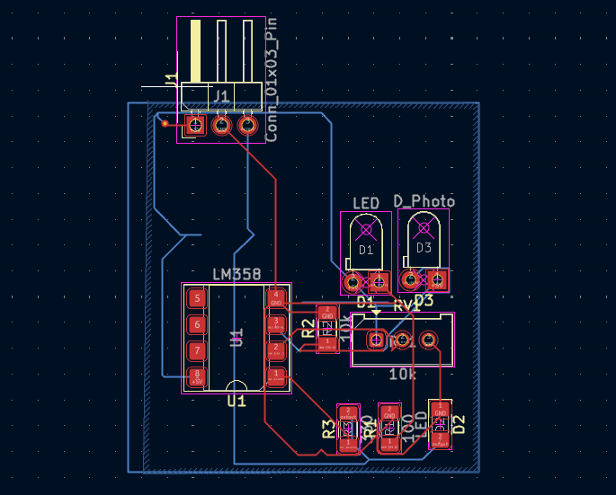
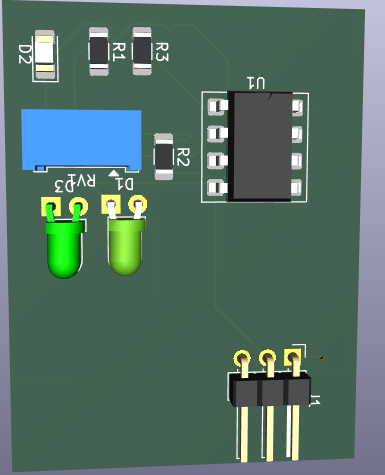
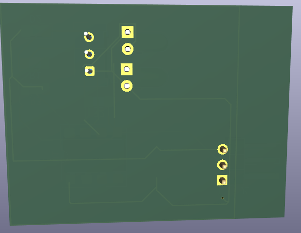

# IR-Sensor-Module-PCB
Custom IR Sensor Module PCB designed in KiCad for object detection and embedded system applications.
# 🔴 IR Sensor Module PCB

---

## 📌 Overview

This project presents a custom-designed Infrared (IR) Sensor Module PCB developed using KiCad. The module is intended for object detection and proximity sensing applications in embedded systems, robotics, and automation projects.

The PCB was designed with a focus on compact layout, reliable signal routing, and ease of manufacturing.

---

## ✨ Features

- Infrared object detection
- Compact PCB footprint
- Easy integration with microcontrollers
- Suitable for robotics projects
- Low-cost and manufacturable design
- Custom schematic and PCB layout

---

## 🛠️ Design Tools

| Tool | Purpose |
|--------|---------|
| KiCad | Schematic Design |
| KiCad PCB Editor | PCB Layout |
| KiCad 3D Viewer | 3D Visualization |

---

## 📷 Project Images

<h2 align="center">📷 Project Gallery</h2>

<h3 align="center">Circuit Schematic</h3>

<h3 align="center">PCB Layout</h3>

<h3 align="center">3D PCB Views</h3>

<table align="center">
<tr>
<td align="center">
 
<b>Front View</b>
</td>

<td align="center">
 
<b>Back View</b>
</td>
</tr>
</table>

---
## 🎯 Applications

- Obstacle Detection
- Line Following Robots
- Automation Systems
- Embedded Projects
- Arduino Projects
- ESP32 Projects

---

## 📈 Skills Demonstrated

✔ Schematic Capture

✔ PCB Layout Design

✔ Component Placement

✔ Signal Routing

✔ Hardware Prototyping

✔ Design for Manufacturing (DFM)

---

## 👨‍💻 Author

### Arham Jaffer

Electrical Engineering Student

PCB Designer | Embedded Systems Developer | IoT Enthusiast

---

⭐ If you found this project useful, consider giving it a star.
